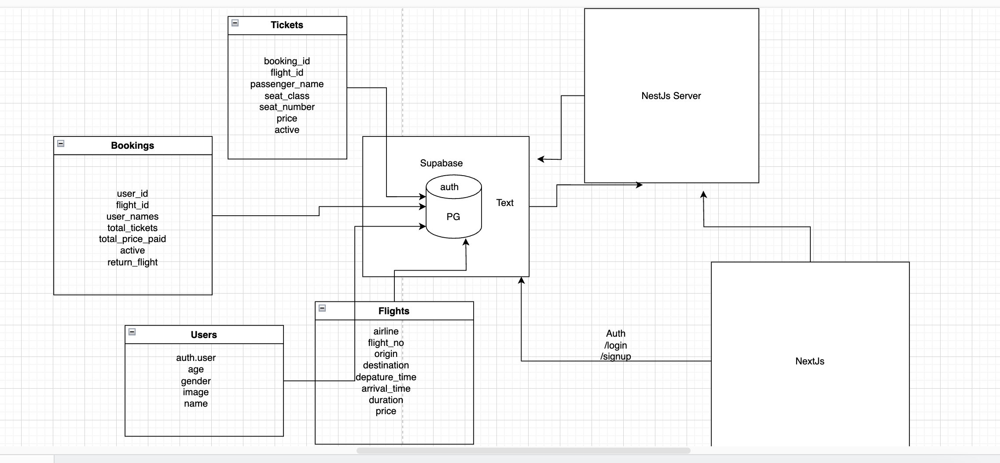

# Flight Booking System Design

Deployed: https://flight-booking-frontend-pi.vercel.app/
<br>
API Doc (swagger) : https://flight-booking-backend-dn12.onrender.com/api/docs

## Overview
This document outlines the system design for a flight booking application built using a modern tech stack. The system allows users to search for flights, book tickets, and manage their bookings. It leverages a relational database (Supabase/PostgreSQL) for data persistence, a Next.js frontend for the user interface, and a RESTful API for communication between components.

The design focuses on scalability, reliability, and user experience, supporting features like flight searches, multi-class ticket bookings (economy, premium, business, first class), and return flight options.

---

## System Architecture
The system follows a client-server architecture with the following components:



### 1. **Frontend**
- **Framework**: Next.js (App Router)
- **Features**:
  - Flight search interface
  - Booking page with class selection and passenger details
  - Ticket management dashboard
- **Notes**: Uses Client Components (`'use client'`) with `Suspense` for dynamic data fetching (e.g., `useSearchParams`).

### 2. **Backend**
- **Framework**: Node.js with Express or NestJS (assumed based on API calls)
- **Database**: Supabase (PostgreSQL)
- **API**: RESTful endpoints for flight search, booking creation, and ticket management
- **Authentication**: Supabase Auth (JWT-based)

### 3. **Database**
- **Type**: PostgreSQL (via Supabase)
- **Tables**: `flights`, `bookings`, `tickets`
- **Relationships**:
  - `bookings.flight_id` → `flights.id` (outbound flight)
  - - `bookings.return_flight_id` → `flights.id` (return flight, nullable)
  - `tickets.booking_id` → `bookings.id`
  - `tickets.flight_id` → `flights.id`

### 4. **External Services**
- **Payment Gateway**: Integrated for booking payments (e.g., Stripe for future)
- **Authentication**: Supabase Auth for user management


---

## Database Design
The database schema is defined in TypeScript and translated to PostgreSQL tables via Supabase.

### Tables

#### 1. `flights`
Represents available flights with pricing and scheduling details.
- **Columns**:
  - `id` (string): Primary key (UUID)
  - `airline` (string): Airline name (e.g., "Vistara")
  - `flight_number` (string): Unique flight identifier (e.g., "AA123")
  - `origin` (string): Departure airport/city
  - `destination` (string): Arrival airport/city
  - `departure_time` (string): ISO timestamp (e.g., "2025-03-15T10:00:00Z")
  - `arrival_time` (string): ISO timestamp
  - `duration` (string): Flight duration (e.g., "2h 30m")
  - `economy_price` (number): Price for economy class
  - `premium_price` (number): Price for premium economy
  - `business_price` (number): Price for business class
  - `first_class_price` (number): Price for first class
  - `created_at` (string): Creation timestamp
- **Insert**: All fields except `id` and `created_at` are required; prices are optional with defaults.
- **Update**: All fields are optional for partial updates.

#### 2. `bookings`
Stores user bookings, linking to flights and tracking total tickets and price.
- **Columns**:
  - `id` (string): Primary key (UUID)
  - `user_id` (string): Foreign key to Supabase `auth.users` (UUID)
  - `flight_id` (string): Foreign key to `flights.id` (outbound flight)
  - `return_flight_id` (string | null): Foreign key to `flights.id` (return flight, nullable)
  - `passenger_name` (string): Representative passenger name (might be redundant with `tickets`)
  - `total_tickets` (number): Total number of tickets in this booking
  - `total_price_paid` (number): Total cost paid by the user
  - `created_at` (string): Creation timestamp
  - `active` (boolean): Indicates if the booking is active (e.g., not canceled)
- **Insert**: `user_id`, `flight_id`, and `passenger_name` are required; others optional.
- **Update**: All fields optional.

#### 3. `tickets`
Individual tickets tied to a booking and flight.
- **Columns**:
  - `id` (string): Primary key (UUID)
  - `booking_id` (string): Foreign key to `bookings.id`
  - `flight_id` (string): Foreign key to `flights.id` (specific flight for this ticket)
  - `passenger_name` (string): Name of the passenger for this ticket
  - `seat_class` (enum): `'economy' | 'premium' | 'business' | 'first_class'`
  - `seat_number` (string | null): Assigned seat (e.g., "12A"), nullable
  - `price` (number): Price paid for this ticket
  - `created_at` (string): Creation timestamp
  - `active` (boolean): Indicates if the ticket is active
- **Insert**: `booking_id`, `flight_id`, `passenger_name`, `seat_class`, and `price` required.
- **Update**: All fields optional.

#### 4. `users`
Stores user profile information with a one-to-one relationship to Supabase `auth.users`.
- **Columns**:
  - `id` (string): Primary key (UUID), matches `auth.users.id`
  - `full_name` (string): User's full name
  - `profile_photo_url` (string, optional): URL to profile photo (must be valid URL)
  - `age` (number, optional): User's age (0-120)
  - `gender` (enum, optional): `'male' | 'female' | 'other'` (assumed Gender enum)
  - `created_at` (string): Creation timestamp (assumed for consistency)
- **Insert**: `full_name` required; others optional.
- **Update**: All fields optional.

### Schema Representation
```typescript
export interface Database {
  public: {
    Tables: {
      flights: { ... },
      bookings: { ... },
      tickets: { ... }.
      users { ... }
    }
  }
}


